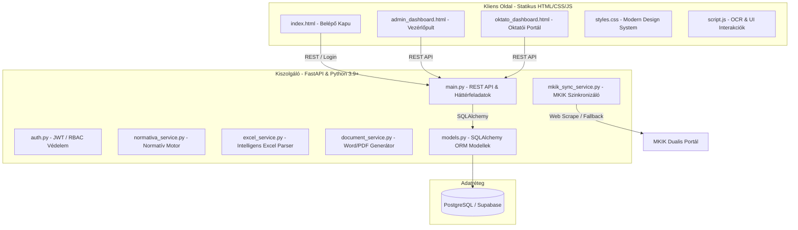

# EduRegistrar ÁKK - Teljes Rendszeraudit és Működési Riport 🚀

Ez a dokumentum az **EduRegistrar ÁKK** (Intelligens Duális Képzési és Iskolai Nyilvántartó Rendszer) teljes körű rendszerauditját, működési elemzését és technikai specifikációját tartalmazza. A riport célja, hogy átfogó képet adjon a rendszer jelenlegi architektúrájáról, üzleti logikájáról, adatbázis-struktúrájáról és jövőbeli fejlesztési lehetőségeiről.

---

## 1. Rendszeráttekintés és Üzleti Fókusz

Az **EduRegistrar ÁKK** egy modern, kifejezetten a szakképzési és duális képzési piacra (ÁKK - Ágazati Képzőközpontok és partnercégek) szabott nyilvántartó és elemző szoftver. A rendszer fő feladata a papírmunka radikális csökkentése, az OCR (karakterfelismerés) alapú adatbevitel, az automatizált duális szerződésgenerálás, a naplószinkronizáció, valamint a szakképzési **normatívák és ROI (Return on Investment)** valós idejű, "Adat-Iker" alapú kalkulációja.

### Fő üzleti értékek:
1. **Compliance (Megfelelőség) biztosítása:** Automatikusan figyeli az orvosi alkalmasságikat, munkavédelmi oktatásokat és a hiányzási korlátokat (pl. a 20%-os törvényi limitet).
2. **ROI Maximalizálás (3. Pillér):** Pontos képet ad arról, hogy az egyes tanulók és osztályok után járó állami normatív támogatás hogyan viszonyul a kifizetett ösztöndíjakhoz és működési költségekhez.
3. **Adminisztrációs automatizálás:** Excel/Kréta importálás, Word (.docx) alapú tömeges szerződésgenerálás, és Kulcs-Soft kompatibilis havi bérfeladó exportálás.

---

## 2. Technológiai Architektúra (Tech Stack)

A rendszer modern, jól skálázható és könnyen üzemeltethető technológiai rétegekből épül fel:

### Részletes Technológiai Összetevők:
*   **Core Backend Framework:** `FastAPI` (Python), amely aszinkron végpontokat biztosít, automatikus Swagger dokumentációval (`/docs`) és villámgyors válaszidőkkel.
*   **Adatbázis Kapcsolat (ORM):** `SQLAlchemy` deklaratív sémákkal. A `database.py` tartalmazza a PostgreSQL-re szabott optimalizációkat (pre-ping, keepalive-ok, Supabase pooling javítás).
*   **Frontend Megvalósítás:** Vanilla HTML5 és CSS3 (Outfit betűtípus, harmonikus sötét tónusú és modern színpaletta, glassmorphism effektek, reszponzív flexbox/grid elrendezés).
*   **Adatfeldolgozás és Matematikai Motor:** `Pandas` az Excel/CSV importáláshoz és strukturált elemzéshez.
*   **Háttérfeladatok:** Integrált, aszinkron eseményhurok (`nightly_sync_loop`) az éjszakai (22:00) szinkronizációk futtatásához.

---

## 3. Adatbázis Modell és Sémák

A rendszer SQL sémája (`models.py`) precízen követi a duális szakképzés entitásait és a szigorú normatíva-kalkuláció igényeit. A táblák struktúrája az alábbi fő csoportokra osztható:

### A) Alapadatok és GDPR Megfelelőség:
*   **`User` (`felhasznalok`):** Felhasználókezelés szerepkör-alapú jogosultságokkal (`admin`, `oktato`, `titkarsag`).
*   **`Student` (`diakok`):** Bővített személyes adatok (OM azonosító, lakhely, adóazonosító, TAJ, bankszámlaszám, orvosi lejárati dátum, munkavédelmi oktatás dátuma, szerződés kezdete/vége).
*   **`AuditLog` (`audit_logs`):** Rendszernapló, amely GDPR szempontból rögzíti, ki, mikor és mit módosított.

### B) Oktatási és Jelenléti Réteg:
*   **`ClassRoom` (`osztalyok`):** Osztályok nyilvántartása elvárt éves gyakorlati óraszámmal (alapértelmezett: 400 óra) és megengedett maximális hiányzási százalékkal (alapértelmezett: 20%).
*   **`Attendance` (`jelenlet`):** Napi jelenléti státuszok rögzítése (`jelen`, `igazolt_hianyzas`, `igazolatlan_hianyzas`) iskola/cég bontásban.
*   **`ExternalGrade` (`kulso_jegyek`):** Tantárgyi érdemjegyek súllyal (százalékban) és típussal (elmélet/gyakorlat).
*   **`DailyLog` (`haladasi_naplo`):** Oktatók által vezetett napi haladási napló (óraszám, témakör, tartalom).

### C) Duális és Pénzügyi Kapcsolatok:
*   **`Partner` (`partnerek`):** Duális partnercégek (cégnév, adószám, székhely).
*   **`DualisSzerzodes` (`szakiranyu_szerzodesek`):** A diák és a partnercég közötti szakirányú munkaszerződés adatai (kezdet, vég, státusz).
*   **`Equipment` (`eszkozok`):** Védőfelszerelések és munkaeszközök követése (átvevő diák, kiadás/visszavétel dátuma).
*   **`SafetyTraining` (`biztonsagi_oktatasok`):** Osztályra vagy egyénre szabott munkavédelmi oktatások lejárata.

### D) Normatíva és ROI Modellek:
*   **`SzakmaTorzs` (`szakma_torzs`):** Szakma-mátrix (szakmaszám, megnevezés, ágazat, súlyozott szorzó *S*, önköltségi alap *O*, adat forrása).
*   **`NormativaKonfig` (`normativa_konfig`):** Globális pénzügyi konfiguráció tanévenként (alap önköltség, sikerdíj százalék).
*   **`TanevRendje` (`tanev_rendje`):** Hivatalos naptár, amely rögzíti a tanítási napokat, szüneteket és munkaszüneti napokat (elengedhetetlen a munkanap-arány *M* precíz kiszámításához).
*   **`KoltsegTetel` (`koltseg_tetelek`):** Egyedi vagy ismétlődő működési költségek (pl. védőfelszerelés, adminisztratív rezsi) diák vagy osztály szinten az ROI finomhangolásához.

---

## 4. A Normatív Kalkulációs Motor (3. Pillér)

A rendszer kiemelkedő része a `backend/normativa_service.py` fájlban található **Normatív és ROI Számítási Motor**, amely a hatályos szakképzési finanszírozási elveken nyugszik.

### A) Havi Normatíva Számítás ($M$ érték kiszámítása)
A havi normatív támogatás alapja a diák jelenléte a céges gyakorlati napokon:

$$\text{Havi Normatíva} = \frac{(O \times S \times M)}{12}$$

Ahol:
*   $O$: Globális önköltségi alap (pl. 1 200 000 Ft).
*   $S$: A szakmára vonatkozó MKIK súlyozó szorzó (pl. Hegesztő esetén 2.4200).
*   $M$: Munkanap arány (a diák havi teljesítése / elvárt munkanapok száma).

#### A jelenlét-logikai motor működése:
1. Lekéri az adott hónap naptári napjait, és a `TanevRendje` alapján levonja a hivatalos munkaszüneti napokat a hétköznapokból, így megkapja az **elvárt munkanapokat**.
2. Összesíti a diák jogosult napjait a `jelenlet` táblából. A jogszabályoknak megfelelően a normatívára jogosító napok: `dualis_nap` (cég), `betegszabadsag`, `fizetett_szabadsag`, valamint a kompatibilitási okokból megengedett `jelen` státusz.
3. Kiszámolja a munkanap arányt ($M = \frac{\text{jogosult napok}}{\text{elvart munkanapok}}$), maximum $1.0$-re korlátozva.
4. Ha a diák eléri a **jogszabályi küszöböt ($M \ge 0.8$)**, akkor a rendszer jelzi, hogy jogosult a teljes támogatásra és a sikerdíjra.

### B) Éves Prognózis és Sikerdíj
A rendszer képes prediktív számítást végezni a teljes tanévre (szeptembertől júniusig, 10 hónap):
*   A **már lezárt hónapoknál** a valós jelenléti adatokból számolt tényleges havi normatívát veszi alapul.
*   A **jövőbeli hónapokra** vonatkozóan $M = 1.0$ (100%-os) teljesítést prognosztizál.
*   Kalkulálja a **sikerdíjat**, amely a sikeres záróvizsga után járó extra támogatás (alapértelmezetten a teljes éves normatíva 20%-a, a `NormativaKonfig`-ból beállíthatóan).

### C) ROI (Return on Investment) Számítás
Az üzleti döntéshozók számára a legimportantabb nézet, amely összeveti a bevételeket és a kiadásokat:

$$\text{Nettó Eredmény} = \text{Normatív Bevétel} - (\text{Kifizetett Ösztöndíjak} + \text{Extra Költségek})$$

Ahol:
*   **Bevétel:** A diák után járó éves (tényleges + várható) normatíva összege.
*   **Kiadások:**
    *   *Kifizetett ösztöndíj:* Átlagosan havi 100 000 Ft / fő (a diák megfelelőségi és tanulmányi átlaga alapján dinamikusan súlyozva a `/stats` API-ban).
    *   *Extra költségek:* A `koltseg_tetelek` táblából lekért egyszeri (pl. munkaruha, orvosi vizsgálat) vagy ismétlődő (pl. oktatói óradíj) tételek.
*   **ROI %:** $\frac{\text{Nettó Eredmény}}{\text{Összes Kiadás}} \times 100$.

### D) "What-If" Stratégiai Szimulátor
Segítségével az intézmény vezetősége modellezni tudja a bevételek alakulását még a csoportok elindítása előtt.
*   A felhasználó megadja a tervezett szakmát és a diákok számát.
*   A rendszer a szakmaszorzók és az önköltség alapján azonnal kiszámítja a várható plusz havi és éves bevételt, és összeveti a jelenlegi havi kerettel.

---

## 5. Integrációk és Automatikus Folyamatok

### A) MKIK Szakmaszorzó Szinkronizáció (`mkik_sync_service.py`)
A szorzók naprakészen tartása kritikus a pontos elszámoláshoz. A rendszer tartalmaz egy intelligens szinkronizálót:
1. Web scrape technológiával megpróbálja lekérni a legfrissebb adatokat a Magyar Kereskedelmi és Iparkamara (MKIK) hivatalos kalkulátor oldaláról (`https://dualis.mkik.hu/kalkulator`).
2. **Robusztus Fallback (Biztonsági háló):** Amennyiben az MKIK oldala nem elérhető vagy blokkolja a lekérdezést, a szerviz automatikusan betölti a hatályos **12/2020 (II.7) Korm. rendelet** szerinti hivatalos szakmaszorzókat (pl. Szoftverfejlesztő: 1.20, Villanyszerelő: 2.15, Hegesztő: 2.42, Ápoló: 2.50).

### B) Intelligens Excel/CSV Adatimport (`excel_service.py`)
A Kréta vagy egyéb iskolai rendszerekből kiexportált adatok beolvasása gyakran hibákhoz vezet az eltérő oszlopnevek miatt. Az EduRegistrar parser motorja ezt kiküszöböli:
*   **Fejléc felismerés:** Végigvizsgálja az első 10 sort, kulcsszavak alapján pontozza őket, és automatikusan azonosítja a tényleges fejléc sorát.
*   **Oszlopnév normalizálás:** Eltávolítja az ékezeteket, kisbetűssé alakítja és regex segítségével párosítja a mezőket (pl. a *"szakiranyu_kepzes_megnevezese"*, *"szakma"*, *"kepzesi_agazat"* oszlopokat mind a `szakma` belső azonosítóhoz rendeli).
*   **Emergency Szakma Fallback:** Ha a diák sora nem tartalmaz explicit szakma oszlopot, a parser végigolvassa a sor összes celláját, és ha valamelyikben szakmai kulcsszót talál (pl. *technikus*, *hegesztő*, *szabó*), azt rendeli hozzá szakmaként, elkerülve a `null` értékeket.
*   **Adathelyreállítás:** Az `/import/patch-szakma` API lehetővé teszi, hogy ha a kezdeti importáláskor a szakmák üresek maradtak, egy újabb CSV feltöltésével (név-egyezés alapján) tömegesen frissíthetőek legyenek a szakma mezők a diákok adatlapján.

---

## 6. Compliance és Korai Figyelmeztető Rendszer (Early Warning)

Az adminisztrációs dashboard és a backend szorosan együttműködik a kockázatok minimalizálása érdekében:

1.  **Munkavédelmi és Orvosi Megfelelőség:** Ha egy diáknál hiányzik a munkavédelmi oktatás dátuma, vagy az orvosi alkalmassági engedélye lejárt, a megfelelőségi státusza automatikusan **piros jelzést** kap.
2.  **Kritikus Hiányzási Figyelmeztetés:** Ha a diák igazolt és igazolatlan hiányzásainak aránya eléri a **15%**-ot, a rendszer automatikusan felveszi a kockázati listára, mivel közelít a **20%-os jogszabályi limithez**, ami felett a tanulmányi évet meg kell ismételni, vagy a munkaszerződést fel kell bontani.
3.  **Lemorzsolódási Kockázat:** A 2.5 alatti tanulmányi átlaggal rendelkező diákok automatikusan figyelmeztető jelzést kapnak.
4.  **Figyelmeztető E-mail kiküldés:** Az admin felületen egyetlen kattintással generálható a hivatalos formátumú, a szülőnek/gondviselőnek küldhető riasztó levél, amely részletezi a fennálló kockázatokat.

---

## 7. Rendszerstabilitás és Diagnosztika

A háttérben futtatott egészségügyi szkriptek (`scratch/check_system_health.py`) és az API tesztek alapján a rendszer állapota: **STABIL**.

### Biztonság és Jogosultságkezelés (RBAC)
A backend szigorú szerepkör-ellenőrzést alkalmaz a kritikus végpontokon:
*   A rendszernaplókhoz (`/audit/`) kizárólag az **Admin** férhet hozzá.
*   A szerződéskötéseket és diákadatok importálását az **Admin** és a **Titkárság** végezheti.
*   A jegyeket és a jelenlétet az **Oktató** és az **Admin** rögzítheti.

---

## 8. Fejlesztési Javaslatok és Útmutató (Jövőkép)

A `fejlesztés/fejlesztesi_terv.md` alapján a rendszer megvalósítása kiváló ütemben halad. A következő fázisok támogatásához javasolt lépések:

| Fázis | Célterület | Javasolt Technikai Megvalósítás |
| :--- | :--- | :--- |
| **1. Fázis** | Diák adatlap bővítés | A `models.py` és a `schemas.py` új mezői (TAJ, adószám, bankszámlaszám, születési adatok) már sikeresen integrálva vannak és készen állnak az UI bekötésre. |
| **2. Fázis** | Digitális jelenléti naptár | Egy reszponzív, havi naptár nézet létrehozása az oktatói felületen a jelenlét gyors, egérrel/érintéssel történő rögzítéséhez. |
| **3. Fázis** | Bérfeladó Export fejlesztése | A jelenlegi CSV export továbbfejlesztése natív `.xlsx` formátumba (pl. `openpyxl` segítségével), igazodva a könyvelőirodák által használt Kulcs-Soft és egyéb bérprogramok import struktúrájához. |

---

> [!NOTE]
> A rendszer mind adatbázis, mind üzleti logika szinten kiváló alapokkal rendelkezik. A normatíva számítás 4 pillére és a ROI motor kifejezetten értékes és egyedi funkcióvá teszi az EduRegistrar szoftvert a piacon.
> 
> *A riport összeállításának időpontja: 2026. május 25.*
